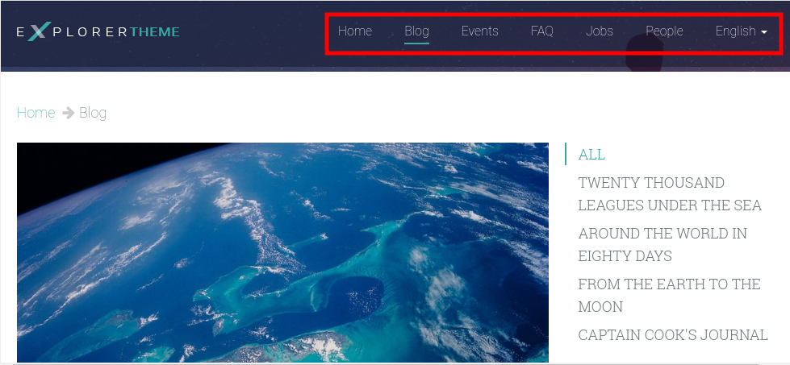
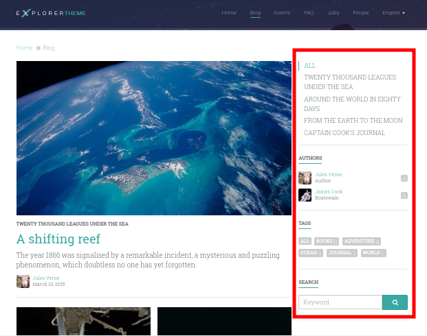
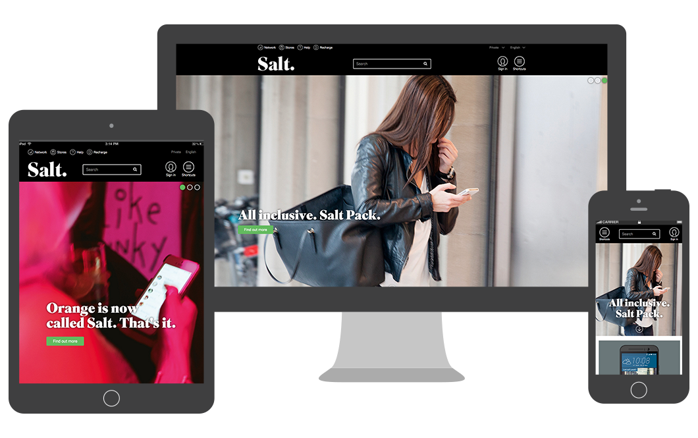

.. title: DjangoCMS

:data-transition-duration: 500
:css: css/presentation.css

----

:id: inicio

Sistema de CMS para Django

.. note::
    Buenas a todos. Es fácil que muchos aquí hayáis venido tentados por la palabra CMS, sin haber tocado
    previamente Django. Para todos aquellos, haré una pequeña introducción.

----

:id: django

.. image:: imgs/django_logo.png

Framework de desarrollo web en Python.

(es decir, te toca picar código).

.. note::
    Django es lo que se denomina un framework para el desarrollo web.

----

:id: django-programadores

Para desarrolladores
--------------------

Django permite a los **PROGRAMADORES** crear sitios web profesionales en muy poco tiempo.

(ayuda a programar webs a medida)

.. note::

    Es decir, está orientado a la creación de nuevos sitios profesionales. Ofrece las
    herramientas para trabajar.

----

:id: django-magia

Pero... ¿y Django CMS? ¿Los CMS no eran *"automágicos"* y no necesitas programar nada?

.. image:: imgs/magic.gif

.. note::

    Ahora puede que algo os estéis preguntando. ¿Programar? ¿Pero los CMS no iban
    de crear sitios sin tener ni idea?

----

:id: cms-magia

Los **CMS** no son *magia*, sino **gestores de contenido** (Content Management System).

Pero ya llegaremos a eso...

.. note::

    Aunque es común la confusión, en realidad CMS viene de Content Management System, o lo
    que es lo mismo, gestores de contenido.

----

:id: framework

Framework
=========
Y eso significa...

Herramientas unificadas y normas de trabajo para un correcto desarrollo.

(es decir, programar sin crear un frankenstein con snippets de Stack Overflow).

.. note::

    Volviendo a Django con los frameworks, un framework es un conjunto de herramientas
    unificadas para el desarrollo.

----

:id: framework-ventajas

Ventajas
--------

* Código más **reutilizable**.
* Código de mejor **calidad**.
* Software más **seguro**.
* Desarrollo más **rápido**.

.. note::

    Esto trae muchas ventajas, como las que tenéis aquí: ....

----

:id: django-webs

Por tanto:

Django (y Django CMS) son una buena solución cuando necesitas una web profesional a medida.

Y algunos ejemplos son:

.. note::
    Y como muestra de su éxito, aquí tenéis algunos sitios que usan Django:

----

:id: django-webs-2

================================  =====================================  ================================
Nasa                              Washington Post                        Pinterest
.. image:: imgs/nasa.png          .. image:: imgs/washington-post.png    .. image:: imgs/pinterest.png
Firefox                           Disqus                                 Bitbucket
.. image:: imgs/firefox.png       .. image:: imgs/disqus.png             .. image:: imgs/bitbucket.png
================================  =====================================  ================================

----

:id: django-ofrece

Qué ofrece Django
=================

* Patrón Modelo-Vista-Controlador (MVC) con:

  * Sistema **ORM** propio.
  * Lenguaje de **plantillas** HTML propio.
  * **Vistas** (controlador) genéricas POO.
  
* Sistema de **urls**.

.. note::

    Perdonad que me enrrolle, pero al ser Django CMS unos módulos para Django, debo
    seguir hablando de él. Al ser todas las características de Django también
    aplicables a Django CMS, repasaré brevemente *sus bondades*: ...

----

:id: django-ofrece-2

* **Localización** (l10n) e **Internacionalización** (i18n)
* **Middleware**, que controla la entrada y salida.
* Sistema de **usuarios y permisos**.
* Medidas de **seguridad** integradas (XSS, CSRF, SQL Inj., clickjacking...).
* Panel de **administración** de datos.

----

:id: django-falta

Pero falta algo...
==================

.. note::
    No obstante, entre estas herramientas falta algo.

----

:id: django-falta-cms

CMS
===

.. note::
    Herramientas para CMS. Y aquí es donde llega Django CMS.

----

:id: django-cms

Django CMS
==========

.. note::
    Django CMS. Completa a Django como framework con herramientas para la gestión de contenido.
    Como por ejemplo ...

----

:id: menu

Menú
====

.. note:: Django CMS nos incluye un sistema para construir menús para nuestras apps. Con
    submenús y mucho más.

----

:id: bloques-plugins

Bloques para plugins
====================

(lo que en otros sistemas se denominan widgets)

.. note:: En vez de widgets, como se llamarían en otros CMS, Django CMS tiene plugins. Éstos
    se colocan en secciones llamadas placeholders, que podremos poner donde queramos en
    nuestros diseños. Los plugins pueden añadirse, reordenarse y quitarse a voluntad.

----

:id: edicion-contenido

Edición de contenido
====================

.. raw:: html

    <video loop data-for="edicion-contenido">
        <source src="resources/djangocms_editar.mkv" type="video/mp4">
    </video>

.. note:: Poniendo el contenido en un bloque específico en el template, éste será modificable
    en modo administrador.

----

Por qué Django CMS
==================

¿Y no otro CMS para Django, como *Wagtail* o *Mezzanine*?

----

* Gran soporte para **internacionalización**.
* Muy **extensible** y **modular**.
* Aprovecha y **no sustituye** a Django.
* Más opciones de **personalización**.
* Es el más **popular** y con mejor **soporte**.

----

:id: django-cms-caracteristicas

Qué incluye Django CMS
======================

----

:id: djangocms-menus

Gestión y creación de páginas
-----------------------------

.. raw:: html

    <video loop data-for="djangocms-menus">
        <source src="resources/djangocms_menus.mkv" type="video/mp4">
    </video>

----

:id: djangocms-contenido

Borradores y publicación de contenido
-------------------------------------

.. raw:: html

    <video loop data-for="djangocms-contenido">
        <source src="resources/djangocms_contenido.mkv" type="video/mp4">
    </video>

----

:id: djangocms-undo

Sistema de versiones
--------------------

.. raw:: html

    <video loop data-for="djangocms-undo">
        <source src="resources/djangocms_undo.mkv" type="video/mp4">
    </video>

----

:id: djangocms-idiomas

Páginas en diferentes idiomas
-----------------------------

.. raw:: html

    <video loop data-for="djangocms-idiomas">
        <source src="resources/djangocms_idiomas.mkv" type="video/mp4">
    </video>

----

:id: djangocms-plugins

Uso de plugins
--------------

.. raw:: html

    <video loop data-for="djangocms-plugins">
        <source src="resources/djangocms_plugins.mkv" type="video/mp4">
    </video>

----

:id: djangocms-apphooks

Uso de Apphooks
---------------

.. raw:: html

    <video loop data-for="djangocms-apphooks">
        <source src="resources/djangocms_apphooks.mkv" type="video/mp4">
    </video>

----

:id: djangocms-probar

Cómo probar Django CMS
======================

* Pruébalo en la demo: http://try.django-cms.org/
* Usa el cloud: https://www.divio.com/

----

:id: aldryn-feature-video

.. raw:: html

    <video loop data-for="aldryn-feature-video">
        <source src="resources/aldryn_feature_video.mp4" type="video/mp4">
    </video>

----

:id: django-cms-webs

Quiénes confían en Django CMS...
================================

================================  =====================================  ================================  ===================================
.. image:: imgs/logos/nasa.png    .. image:: imgs/logos/natgeo.png       .. image:: imgs/logos/parrot.png  .. image:: imgs/logos/pbs.png
.. image:: imgs/logos/salt.png    .. image:: imgs/logos/men_expert.png   .. image:: imgs/logos/aamc.png    .. image:: imgs/logos/canonical.png
================================  =====================================  ================================  ===================================

----

:id: django-cms-salt

